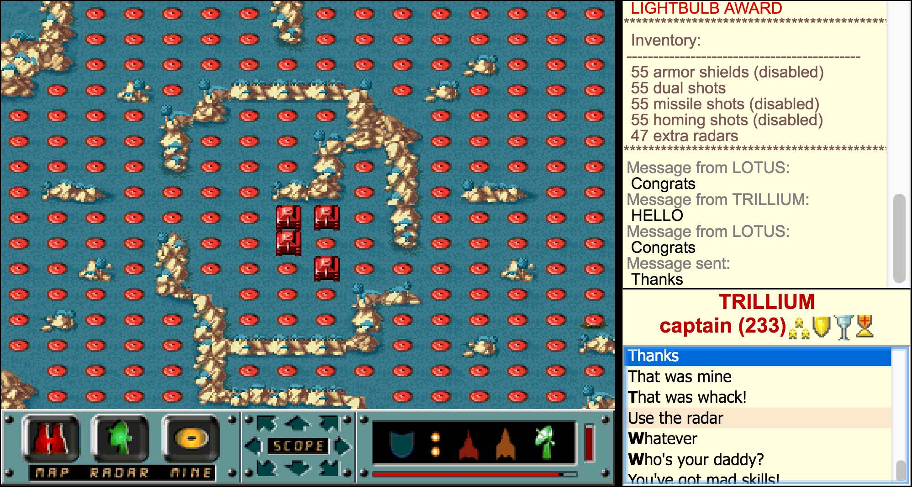
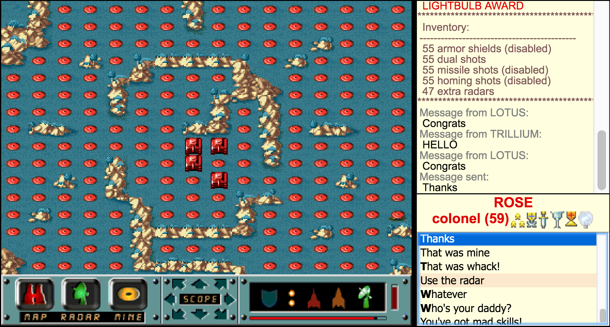
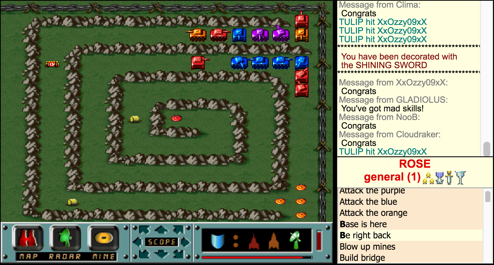

### April 17, 2017 TRILLIUM is awarded the DEFENDER OF THE TRUTH & WAR CORRESPONDENT
{:.game-screenshot} ROSE is awarded the WAR CORRESPONDENT & LIGHTBULB AWARD
{:.game-screenshot}

### April 8, 2017 While everyone was asleep, a new spring flower has blossomed: HYDRANGEA

### March 23, 2017 GLADIOLUS is awarded the SHINING SWORD 
{:.game-screenshot}

### March 14, 2017 Please welcome our latest FLOWER: DAHLIA

### March 11, 2017 LOTUS is awarded the SHINING SWORD 
{:.game-screenshot}

### March 6, 2017 A new FLOWER has bloomed! HIBISCUS

### March 5, 2017 ROSE is awarded the SHINING SWORD 
{:.game-screenshot}

### March 4, 2017 FLOWERS switch colors to red, and welcome a new member: BUTTERCUP

### February 26, 2017 Two new FLOWERS blossom: GLADIOLUS & DAISY

### February 18, 2017 FLOWERS founded by ROSE, LOTUS, TULIP, LILAC & ORCHID
